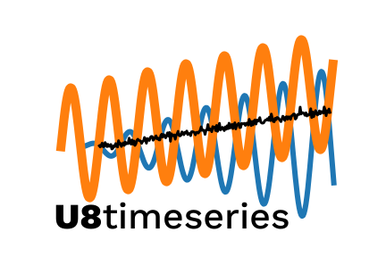
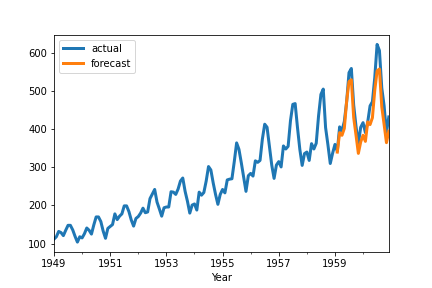

**u8timeseries** is a python library for easy manipulation and forecasting time series in python.
It contains a variety of models, from classics such as ARIMA to neural networks.
The models can all be used in the same way, using `fit()` and `predict()` functions,
similar to scikit-learn. The library also makes it easy to backtest models,
and combine the predictions of several models and external regressors.

## install

### using conda
`pmdarima` is currently not supported on conda which means we need to reinstall it through pip

    conda env create -f conda_recipe/environment.yml
    conda install -c conda-forge -c alkaline-ml --name u8timeseries-dev --file requirements/main.txt
    # here install any additional dev requirements from the other requirements/*.txt files
    source activate u8timeseries-dev
    pip install "pmdarima>=1.5.3"
    pip install --no-deps -e .
    
### pure pip
This approach most likely requires other non-Python dependencies.

    # if plotting tweaks provided by u8timeseries are required
    pip install .[plots]
    # otherwise just
    pip install .
    # install any additional dev requirements, e.g.:
    pip install -r requirements/docs.txt

**Running the examples only without installing:**

To run the example notebooks without installing, using Docker, you can also run: 
```
./build_docker.sh && ./run_docker.sh
```
Then copy and paste the URL provided by the docker container into your browser to access Jupyter notebook.

### docker

## Example Usage
Create `TimeSeries` object from a Pandas DataFrame, and split in train/validation series:
```python
from u8timeseries import TimeSeries

df = pd.read_csv('AirPassengers.csv', delimiter=",")
series = TimeSeries.from_dataframe(df, 'Month', '#Passengers')
train, val = series.split_after(pd.Timestamp('19590101'))
```

Fit an exponential smoothing model, and make a prediction over the validation series' duration:
```python
from u8timeseries import ExponentialSmoothing

model = ExponentialSmoothing()
model.fit(train)
prediction = model.predict(len(val))
```

Plot:
```python
series.plot(label='actual', lw=3)
prediction.plot(label='forecast', lw=3)
plt.legend()
plt.xlabel('Year')
```


We invite you to go over the example notebooks in the `examples` directory.

## Documentation
The documentation of the API and models is available [here](https://unit8co.github.io/u8timeseries/).

## List of Features
Currently, the library contains the following features: 

**Forecasting Models:** 
* Exponential smoothing, 
* ARIMA & auto-ARIMA,
* Facebook Prophet,
* Theta method, 
* Recurrent neural networks (vanilla RNNs, GRU, and LSTM variants).

**Preprocessing:** Transformer tool for easily scaling / normalizing time series.

**Metrics:** A variety of metrics for evaluating time series' goodness of fit; 
from R2-scores to Mean Absolute Scaled Error.

**Backtesting:** Utilities for simulating historical forecasts, using moving time windows.

**Regressive Models:** Possibility to predict a time series from several other time series 
(e.g., external regressors), using arbitrary regressive models.


## Contribute
The development is ongoing, and there are many new features that we want to add. 
We welcome pull requests and issues on github.
